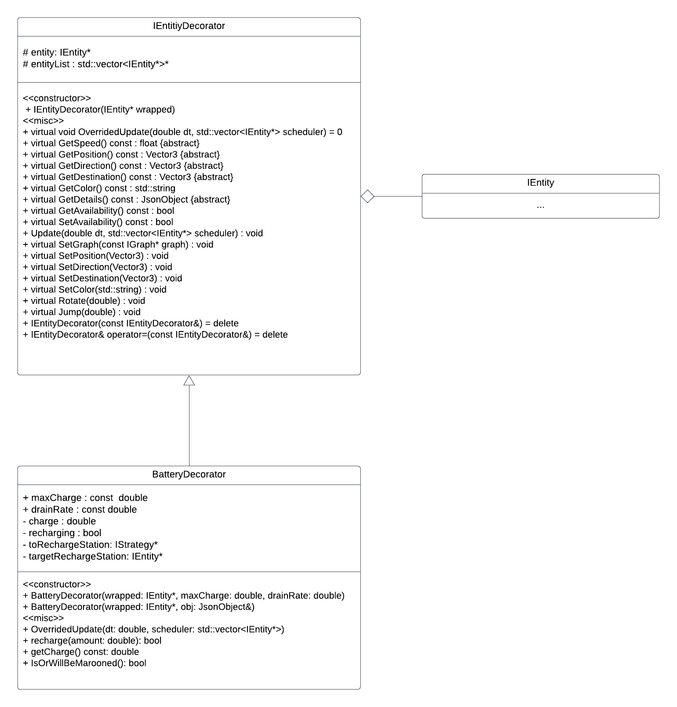
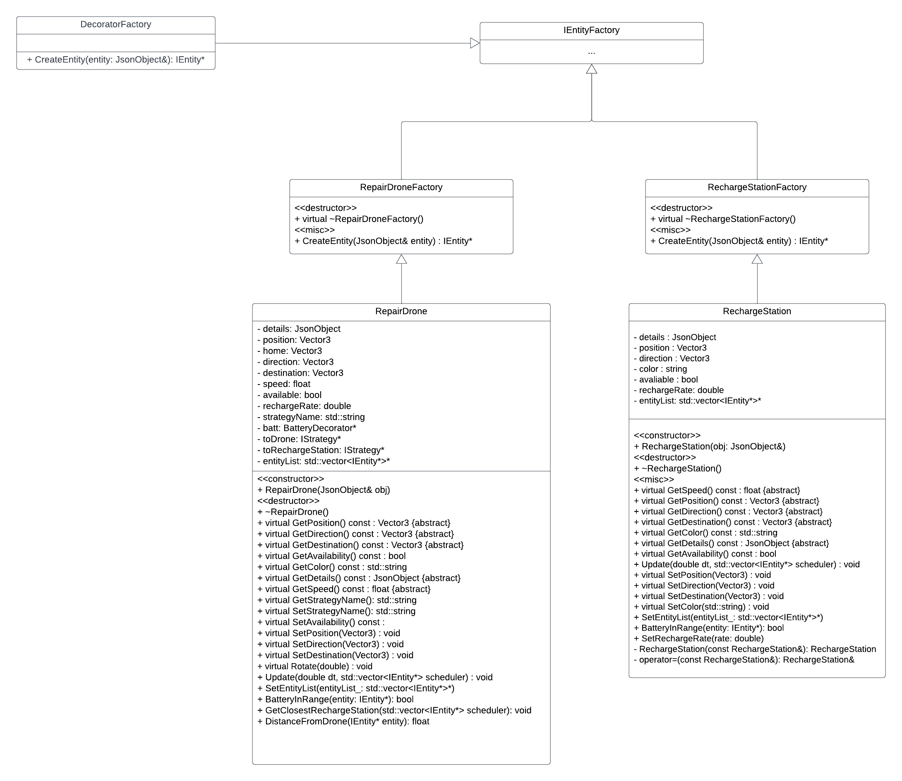
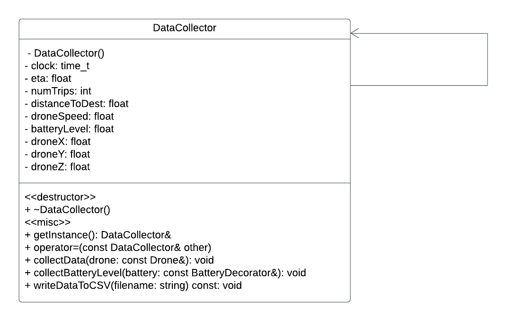

# Team-010-46

* Muhammad Abuzar abuza006 
* Anirudh Ganesh  ganes099
* Ronit Motwani   motwa011
* Tony Skeps      skeps002

# What is the project about? 

The project is a simulation of an Uber-like service that uses drones to pick up robots from various locations. The project involves a scheduler, implementing a simulation model server that can be used to navigate the simulation, as well as developing software to control the drones and coordinate the pickup and delivery of the robots.

# How to run the simulation?

To run the simulation, you can follow these steps:

1. Navigate to the project directory on your local machine using the command line.
2. Build the project using the command "make -j".
3. Run the project using the command "./build/bin/transit_service 8081 apps/transit_service/web/".
4. Open a web browser and go to "http://127.0.0.1:8081" to view the 3D visualization of the simulation.
5. To schedule a trip, go to "http://127.0.0.1:8081/schedule.html", enter the passenger name and start/end destinations, and click the "Schedule Trip" button.
6. To change the camera view of the simulation, use the options in the top right corner of the visualization window.

Note that if port 8081 is not available, you can use a different port (e.g. 8082, 8083, etc.) by replacing "8081" in the commands above with the desired port number. Also, if you are running the simulation on a CSE Lab machine, you will need to use SSH and port forwarding to access the visualization and scheduling pages.

 

 

# What does the simulation do specifically (individual features ie movement of entities etc)?

## New Feature 1: Decorator and Factory pattern - Battery and Recharge Station Decorator

## What does it do?

The battery and recharge station decorator adds the ability to track the battery level of drones in the 3D simulation. As time passes, the battery level decreases by 2% starting from 100%. If the battery level goes below a certain threshold or reaches 0%, the drone cannot move/deliver the robot anymore. The recharge station is a new entity that the drone can go to in order to recharge its battery. There is also a repair drone that can go to a drone with a low battery level and charge it up.

## Why is it significantly interesting?

This feature adds a new level of realism and complexity to the simulation by introducing the concept of battery life and recharging. It also opens up the possibility for new strategies and tactics to be employed in order to manage the battery levels of drones.

## How does it add to the existing work? 

This feature builds upon the existing work by adding a new layer of functionality to the drones. It also adds two new entities to the simulation, the recharge station and the repair drone.

## Which design pattern did you choose to implement it and why? 

The decorator pattern was chosen to implement this feature as it allows for the addition of new behavior to an object dynamically at runtime without affecting the behavior of other objects in the same class.

## Instruction to use this new feature (if the new feature is not user interactable, please mention this as well)

This feature is not user interactable, but rather works automatically. The drone will automatically seek out recharge stations, and repair drones will charge the drone if necessary. No user input is required on the front end, but if more charging stations are desired the umn.json file must be edited to add new entities. 

 

# New Feature 2: Singleton pattern - Data collection

## What does it do?

The singleton data collection feature allows for the tracking of various data points from the simulation, such as the speed of drone, the position of drone, number of trips, estimated time to arrival, estimated distance to arrival and a clock time stamp in a CSV file. This data can then be analyzed to gain insights into the performance of the simulation.

## Why is it significantly interesting?

This feature allows for the collection and analysis of data from the simulation, which can be used to optimize and improve the simulation. It also adds a layer of analytics to the simulation, allowing for more in-depth analysis of its performance.

## How does it add to the existing work? 

This feature builds upon the existing work by adding the ability to track and analyze data from the simulation. It also adds a layer of insight into the performance of the simulation that was not present before.

## Which design pattern did you choose to implement it and why? 

The singleton pattern was chosen to implement this feature as it allows for the creation of a single instance of a class that can be accessed globally. This is useful for data collection as it ensures that there is only one instance of the data collection class that is collecting data throughout the simulation.

## Instruction to use this new feature (if the new feature is not user interactable, please mention this as well)

Everytime a new simulation is run a new CSV file with the current timestamp is created automatically which can be found inside the project folder or repository online. 

# Sprint retrospective

We decided on only one sprint for this project because we believed the task could be accomplished in one sprint with proper work ethic. We had a fall back plan to check in after 3 weeks and potentially add a new sprint if necessary, but it turned out that at the 3 week mark we were on track and kept with the initial one sprint plan. The project sprint was a success, and we were able to complete our project within the given time frame. We had a team of 4 members, and each one of us contributed equally to the project. We had regular meetings and communicated well with each other throughout the sprint. We ensured to make time for regular meetings and communication to stay on track with our tasks and deliverables, meeting every tuesday and thursday. At the end of the sprint, we feel proud of what we have accomplished, as we had completed all the project requirements, tested thoroughly, and delivered a high-quality product. However, we also identified some areas for improvement, such as better time management (since we struggled a bit with integration in the final week), more efficient communication, and more extensive documentation. 

# Youtube Video
[Project Demonstration](https://youtu.be/X0MGkpj477A)

# Docker Link
[Docker Link](https://hub.docker.com/repository/docker/anirudhganesh/drone_extension/general)

